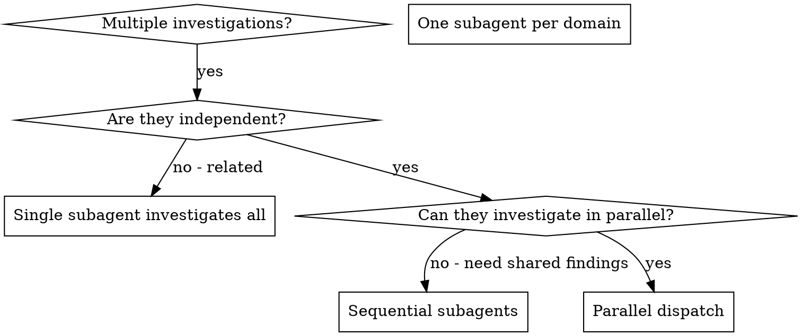

# Dispatching Parallel Research Subagents

## Overview

You delegate research to specialized subagents with isolated context. By precisely crafting their instructions and context, you ensure they stay focused and succeed at their investigation. They should never inherit your session's context or history — you construct exactly what they need. This also preserves your own context for coordination work.

When you have multiple unrelated investigation domains (different test files to understand, different subsystems to map, different bugs to characterize), investigating them sequentially wastes time. Each investigation is independent and can happen in parallel.

**Cline-specific:** subagents are READ-ONLY. They cannot edit, run tests, or commit. They investigate and report; you implement.

**Core principle:** Dispatch one subagent per independent investigation domain. Let them work concurrently. The main agent integrates findings and implements.

## When to Use



**Use when:**
- 3+ test files / subsystems / modules need independent research
- Multiple bugs need root-cause investigation in different code areas
- Each investigation can be understood without context from others
- No shared state between investigations

**Don't use when:**
- Investigations are related (findings of one inform others)
- Need to understand full system state holistically
- You already know which files to read

## The Pattern

### 1. Identify Independent Domains

Group investigations by what's being explored:
- Domain A: Tool approval flow code
- Domain B: Batch completion behavior code
- Domain C: Abort functionality code

Each domain is independent — researching tool approval doesn't depend on abort findings.

### 2. Create Focused Subagent Tasks

Each subagent gets:
- **Specific scope:** One test file, module, or subsystem
- **Clear research question:** What do we need to know?
- **Constraints:** Read-only — do not propose edits, just report findings
- **Expected output:** Structured findings report (file:line refs + analysis)

### 3. Dispatch in Parallel

In your reply, describe the parallel dispatch:

```
Dispatch subagent A: investigate agent-tool-abort.test.ts failures
Dispatch subagent B: investigate batch-completion-behavior.test.ts failures
Dispatch subagent C: investigate tool-approval-race-conditions.test.ts failures
```

Each subagent runs read-only research and returns its report. The main agent integrates and implements fixes.

### 4. Integrate Findings and Implement

When subagents return:
- Read each report
- Identify consistent or conflicting findings
- Decide implementation approach across domains
- Implement yourself (main agent — subagents cannot edit)
- Run full test suite to verify

## Subagent Prompt Structure

Good subagent prompts are:
1. **Focused** — one clear domain
2. **Self-contained** — all context the subagent needs
3. **Read-only framing** — emphasize investigation, not implementation
4. **Specific about output** — what report format?

```markdown
Investigate the 3 failing tests in src/agents/agent-tool-abort.test.ts:

1. "should abort tool with partial output capture" - expects 'interrupted at' in message
2. "should handle mixed completed and aborted tools" - fast tool aborted instead of completed
3. "should properly track pendingToolCount" - expects 3 results but gets 0

These look like timing or race-condition issues. Your task (read-only):

1. Read the test file and understand what each test verifies
2. Read related production code referenced by the tests
3. Use `execute_command "git log --since=1.month -- <path>"` to see recent changes
4. Identify the likely root cause for each failure

You are READ-ONLY. Do not propose edits. Report findings:
- For each test: likely root cause with file:line refs
- Recommended fix approach (main agent will implement)
- Any open questions for the main agent

Return: structured findings report.
```

## Common Mistakes

**❌ Too broad:** "Investigate all the tests" - subagent gets lost
**✅ Specific:** "Investigate agent-tool-abort.test.ts" - focused scope

**❌ No context:** "Look at the race condition" - subagent doesn't know where
**✅ Context:** Paste the error messages, test names, file paths

**❌ Implementation tone:** "Fix the bug" - subagent cannot edit; confusing
**✅ Research tone:** "Identify the likely root cause; report file:line refs"

**❌ Vague output:** "Tell me what's wrong" - no structure
**✅ Specific output:** "Return: for each test, likely root cause + recommended approach"

## When NOT to Use

**Related investigations:** Findings of one inform others — sequence them
**Need full context:** Understanding requires seeing whole system at once
**Pure exploratory debugging:** You don't know enough yet to delegate
**You already know the answer:** Direct implementation faster than research overhead

## Real Example

**Scenario:** 6 test failures across 3 files after major refactoring

**Failures:**
- agent-tool-abort.test.ts: 3 failures (suspected timing)
- batch-completion-behavior.test.ts: 2 failures (suspected event ordering)
- tool-approval-race-conditions.test.ts: 1 failure (suspected async)

**Decision:** Independent domains — investigate in parallel

**Dispatch:**
```
Subagent A → Research agent-tool-abort.test.ts: read test + production code, identify timing dependencies, report recommended fix approach
Subagent B → Research batch-completion-behavior.test.ts: read test + event-bus code, identify ordering issues
Subagent C → Research tool-approval-race-conditions.test.ts: read test + async flow, identify race window
```

**Results:**
- Subagent A: "Tests rely on arbitrary timeouts; recommend condition-based-waiting pattern in tests at agent-tool-abort.test.ts:45, :120, :180"
- Subagent B: "Event-bus emits threadId at wrong nesting level; src/event-bus.ts:67 should emit threadId at envelope level not data level"
- Subagent C: "Test asserts execution count before async tool resolves; needs await on tool result at tool-approval-race-conditions.test.ts:38"

**Integration (main agent):**
- Update tests in A using condition-based-waiting helper
- Fix event structure in src/event-bus.ts (B finding)
- Add explicit await in C test
- Run full suite to verify

**Time saved:** 3 investigations concurrent rather than sequential.

## Key Benefits

1. **Parallelization** — multiple investigations happen simultaneously
2. **Focus** — each subagent has narrow scope, less context to track
3. **Independence** — subagents don't interfere with each other
4. **Context preservation** — main agent's context stays clean for coordination

## Verification

After subagents return:
1. **Review each report** — understand what each found
2. **Cross-check overlap** — if subagents' domains touched, do findings agree?
3. **Confirm main agent implements** — never let a subagent attempt edits (they cannot)
4. **Run full suite after implementation** — verify all fixes work together
