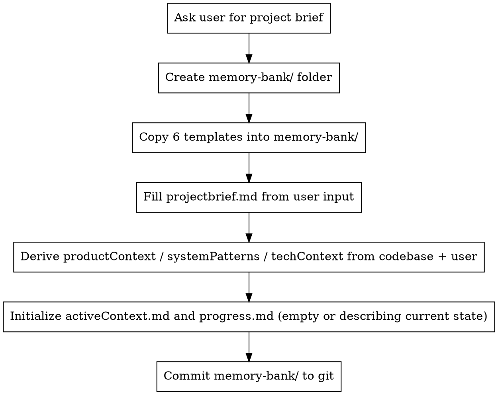

# Using Memory Bank

## Overview

The Memory Bank is a folder of 6 markdown files in `<workspace>/memory-bank/`
that captures persistent project state. Because Cline's working memory
resets between sessions (and gets compressed within long ones), the Memory
Bank is the only mechanism that lets the agent continue work coherently
across boundaries.

**Core principle:** Memory Bank is the agent's only continuity. Treat it
as authoritative; update it as you work; read it at the start of every
session.

## When to Use

- **Start of every session** — before anything else, read all 6 files.
- **After context compaction** — re-read to recover continuity.
- **User asks to initialize** — create the folder and 6 templates.
- **User says "update memory bank"** — full review of all 6 files.
- **User says "follow your custom instructions" / "resume"** — re-read,
  pick up where `progress.md` / `activeContext.md` left off.
- **After significant change** — completed a task, hit a blocker, made
  an architecture decision: update the relevant file(s).

## The 6 Core Files

Files live in `<workspace>/memory-bank/`. They form a hierarchy from
stable (top) to volatile (bottom):

| # | File | What it captures | How often it changes |
|---|---|---|---|
| 1 | `projectbrief.md` | What the project is, scope, goals | Rarely (project start, scope change) |
| 2 | `productContext.md` | Why it exists, target users, UX goals | Rarely |
| 3 | `systemPatterns.md` | Architecture, patterns, key decisions | When architecture changes |
| 4 | `techContext.md` | Tech stack, dependencies, dev setup, constraints | When deps/setup changes |
| 5 | `activeContext.md` | Current focus, recent changes, next steps | Every session, every task |
| 6 | `progress.md` | What works, what's left, status, known issues | Every task completion |

`projectbrief.md` is foundational — the other 5 derive context from it.

Template files for all 6 live in `skills/using-memory-bank/templates/` of
this repo. Use them as starting points when initializing.

## Workflows

### Initial setup (project has no Memory Bank yet)

Steps:

1. **Get the project brief from the user.** A few sentences describing what
   this project is and its scope. Don't proceed without this.
2. **Create `<workspace>/memory-bank/` folder.**
3. **Copy templates.** From the skill's `templates/` folder, copy all 6
   files into `memory-bank/`. (Path: read templates from
   `.cline/skills/using-memory-bank/templates/*.md`, write to
   `<workspace>/memory-bank/`.)
4. **Fill `projectbrief.md`** with the user's description.
5. **Derive context.** Explore the codebase (read README, package.json,
   recent commits, top-level structure) to fill `productContext.md`,
   `systemPatterns.md`, and `techContext.md`. Ask the user for anything
   you cannot derive.
6. **Initialize `activeContext.md` and `progress.md`** — even if empty,
   note "Project initialized on YYYY-MM-DD. Nothing in progress yet."
7. **Commit** all 6 files to git so they survive across machines.

### Session resume (Memory Bank exists)

Triggered automatically by the `.clinerules/02-memory-bank.md` rule, or
manually by the user typing "follow your custom instructions" / "resume":

1. Read all 6 files in the order listed above (brief → product → system →
   tech → active → progress).
2. Synthesize: "Based on Memory Bank, I understand we're working on X.
   Last session ended at Y. Next planned step is Z. Is that right?"
3. Wait for user confirmation or correction.
4. Proceed with the next step.

### During work — incremental updates

After ANY of these events, update Memory Bank before moving on:

| Event | Update which file(s) |
|---|---|
| Completed a task | `progress.md` (move task to "done"), `activeContext.md` (next focus) |
| Started a new task | `activeContext.md` (current focus) |
| Hit a blocker | `activeContext.md` (note blocker), `progress.md` (known issue) |
| Architecture decision | `systemPatterns.md`, plus brief note in `activeContext.md` |
| Added a dependency | `techContext.md` |
| Discovered a pattern worth keeping | Add to `.clinerules/` (project-specific learnings) |
| User clarifies scope | `projectbrief.md` and propagate downstream if needed |

Updates should be **brief and factual** — bullet points and short
paragraphs. Memory Bank is for state, not narrative.

### Full review — "update memory bank"

When the user says "update memory bank", do this comprehensively:

1. Read all 6 current files.
2. Re-derive each from current codebase + recent commits + conversation.
3. Rewrite each file so it accurately reflects current state.
4. Commit the updated Memory Bank.

This is heavier than incremental updates — typically done before a long
break or major milestone.

## Anti-Patterns

**Skipping the read at session start.** Even if you "remember" from
a previous turn, after compaction or restart your memory is wrong. Read
the files. Every time.

**Vague updates.** "Made some progress" is useless. Write what changed,
which files, which task number, what's next.

**Forgetting to update before ending a session.** Future-you (or the
agent in the next session) cannot read your mind. Update `activeContext.md`
and `progress.md` before the session ends.

**Storing implementation details in Memory Bank.** Code lives in code.
Memory Bank stores *which* features exist, *why* they exist, *current
status* — not how each function works.

**Treating Memory Bank as a journal.** It's a current-state document.
Old state can be replaced — git history preserves the chronology.

## Integration with Superpowers

- `brainstorming` → writes spec to `docs/superpowers/specs/`; afterward,
  update `projectbrief.md` if scope changed, update `activeContext.md`
  with the new feature focus.
- `writing-plans` → writes plan to `docs/superpowers/plans/`; afterward,
  update `progress.md` with the new plan's tasks as "pending".
- `executing-plans` / `subagent-driven-development` → as each task
  completes, update `progress.md` (mark task done) and `activeContext.md`
  (next task).
- `finishing-a-development-branch` → after merging/closing the branch,
  archive its plan reference in `progress.md` and clear `activeContext.md`.

## Red Flags — STOP and read/update Memory Bank

- Starting work without reading Memory Bank
- Completing 3+ tasks without updating `progress.md`
- Ending session without updating `activeContext.md`
- Telling the user "I remember we were working on..." without first
  reading `activeContext.md`
- User asks "where were we?" and you guess instead of reading

## Quick Reference

| User says | Action |
|---|---|
| "initialize memory bank" | Follow the Initial setup workflow above |
| "follow your custom instructions" | Read all 6 files; report current state |
| "resume" | Same as above |
| "update memory bank" | Full review and rewrite of all 6 files |
| (nothing — start of session) | Triggered by `.clinerules/02-memory-bank.md`: read all 6 files first |
